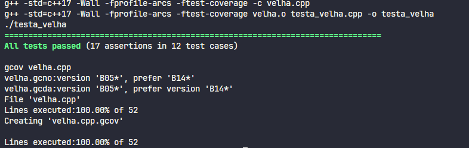

# Tic Tac Toe with TDD

## Setup

```sheel
sudo apt-get install g++
sudo apt-get install make
sudo apt-get install valgring
sudo apt-get install cppcheck
sudo apt-get install clang-format-14

make all
make gcov
```

## Documentation

<h4>
Este trabalho desenvolve um verificador do resultado de uma partida de jogo da velha a, utilizando os princícios de Test Driven Development (TDD). Considerando 5 cenários:
</h4>

<ul>
    <li>Impossível: quando o jogo tem 2 jogadas ou mais de um jogador a mais que outro; quando o jogo tem mais de um vencedor; ou quando o perdedor jogou mais que o vencedor</li>
    <li>Indefinido: Quando ainda tem movimentos a se fazer (espaços vazios) e ninguém ganhou </li>
    <li>Empate:  Quando não se tem movimentos a se fazer (espaços vazios) e ninguém ganhou</li>
    <li>Vitória de X: Quando o X preenche uma linha, uma coluna ou uma diagonal com apenas seus elementos</li>
    <li>Vitória de O: Quando o O preenche uma linha, uma coluna ou uma diagonal com apenas seus elementos</li>
</ul>
 

## Resultados

After compile, run the tests and the coverage, I achieved this result:



## Author
<table>
  <tr>
    <td align="center"><a href="https://github.com/lucasdbr05" target="_blank"><br /><sub><b>Lucas Lima</b></sub></a><br /></td>
</table>
